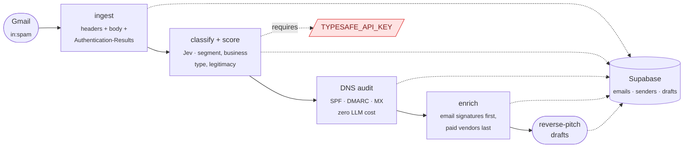

# Spam → Lead Gen Pipeline

Your spam folder is a lead list someone else paid to build.

Every cold email sitting in there is a sender with a **broken email infrastructure** — that's literally why it's in spam. If you sell deliverability, GTM engineering, or outbound services, those senders are pre-qualified prospects who already told you (a) they do cold outbound and (b) it isn't landing. This pipeline mines them, scores them against your ICP, builds a real deliverability audit of their domain from DNS + their own email's headers, and drafts a reverse-pitch: *"your email to me landed in spam — here's exactly why, want the full audit?"*



**Real first run:** 115 spam emails → 59 company domains → 19 ICP-qualified senders, each with a domain audit and a drafted pitch. Total LLM spend: about one cent.

---

## How it works

### 1. Ingest — `npm run ingest`

Pulls everything matching `in:spam` via the Gmail API (read-only scope). For each email it stores the sender, subject, plain-text body, and the one header most people throw away: **`Authentication-Results`**. That header is Gmail's own verdict on the sender's SPF, DKIM, and DMARC — which means every prospect arrives carrying the evidence for their own audit. Idempotent on message id; `--max 25` for test batches.

### 2. Classify + qualify — `npm run classify`

Each email gets one batched request to [Jev](https://typesafe.ai) (TypeSafe's System One model — typed judgments, not generated text):

| Question | Primitive | Output |
|---|---|---|
| What kind of outreach is this? | Choice | `agency_service_pitch`, `cold_saas_sales`, `lead_gen_offer`, `recruiting`, `newsletter_blast`, `scam_phishing`, `other` + full probability distribution |
| What kind of business is the sender? | Choice | `marketing_gtm_agency`, `leadgen_outbound_shop`, `b2b_saas_sales_martech`, `recruiter_staffing`, `other` |
| Is this a genuine business, not a scam? | Noul | a single probability |

Emails roll up to one `senders` row per domain (freemail domains like gmail.com are excluded — you can't audit gmail.com). A sender qualifies when its business type is in your ICP set with probability ≥ 0.6 **and** legitimacy ≥ 0.5. Both thresholds live at the top of `src/classify.ts`, and the legitimacy gate is deliberately loose: enrichment acts as the second filter, and in practice scams scored 0.14–0.40 while real-but-spammy businesses scored 0.5+.

Why Jev instead of a frontier LLM? Classification here is a typed judgment, not prose. At $42 per **billion** input tokens, classifying an entire spam folder costs about a cent, roughly 200x less than the same job through a chat model.

### 3. Audit — `npm run audit`

The audit that powers the pitch is **pure DNS + the evidence already in hand**. Zero LLM cost:

- SPF record present and valid (TXT lookup)
- DMARC record and policy — `none` / `quarantine` / `reject` (`_dmarc.` TXT lookup)
- MX hosts → mailbox provider and any security gateway (suffix match against `src/gateway-map.json`)
- Their actual email's SPF/DKIM/DMARC verdicts, straight from the `Authentication-Results` header

Findings come out as pre-written copy fragments, e.g. *"Your DMARC policy is p=none — it monitors but doesn't protect, and mailbox providers score that accordingly."* When all auth passes but the mail still hit spam, that's a finding too — it means domain reputation, the harder half of deliverability.

### 4. Enrich — signatures first, vendors last

A lesson this repo paid 15 credits to learn: **cold-outbound sending domains are invisible to data vendors.** They're burner domains — `somethingflow.click`, `brandnamehub.com` — spun up weeks ago. Email→LinkedIn lookups returned 0 hits on 15 attempts.

The free path works better: the **email signature** usually names the real company and person, because the pitch has to be signed by someone. Extraction order:

1. Parse the real company/person out of the email body and signature (free)
2. Reply-to-sender is always valid — they emailed you, and they monitor replies; that's the whole point of their campaign (free)
3. Paid decision-maker lookup only for confirmed real companies where a more senior contact beats answering the SDR (1–3 credits each)

### 5. Draft — the reverse-pitch

Drafts land in the `drafts` table (`draft` → `approved` → `sent`), written to a cold-email framework: under 90 words, give-first, one interest-based CTA, no links, lowercase internal-note subject. The shape:

> **subject:** your dkim
>
> {name}, your {their pitch, referenced specifically} reached me, in the spam folder.
>
> took a look at why: {one concrete audit finding about their domain, in plain words}.
>
> i run {your co}, we fix sending infrastructure for gtm teams. put together a short teardown of what is tripping {company}'s sends and the fix order.
>
> want me to send it over?

The hook writes itself because every claim is verifiable by the prospect in 30 seconds: it's their domain, their DNS, their email.

---

## What you get

One Supabase row per qualified sender, carrying everything needed to pitch:

| Field | Example |
|---|---|
| `domain` | the sending domain |
| `business_type` / `segment` | `leadgen_outbound_shop` / `lead_gen_offer` |
| `legit_prob`, `business_type_prob` | raw Jev probabilities, reusable if you re-tune thresholds |
| `audit` | SPF/DMARC/MX facts + findings as ready-to-quote copy fragments |
| `enrichment.real_company` | the actual company behind the burner domain, from their signature |
| `evidence_gmail_id` | the email that proves the pitch |

Plus a `drafts` row with subject + body, waiting for review.

## What it costs

| Component | Per row |
|---|---|
| Gmail API, DNS audit, Supabase free tier | $0 |
| Jev classification (~2K input tokens) | ~$0.00008 |
| Signature enrichment + drafting | $0 marginal (runs in a Claude Code session) |
| Optional vendor enrichment | 1–3 credits, real companies only |

~**$0.0001 per email, end to end.** Run it daily forever and never notice the bill.

---

## Setup

You need Node 20+, a Gmail account, a free [Supabase](https://supabase.com) project, and a [TypeSafe](https://typesafe.ai) API key.

1. **Google OAuth** — In [Google Cloud Console](https://console.cloud.google.com): create a project, enable the **Gmail API**, create an **OAuth client ID → Desktop app** (not Web application — the JSON must have an `installed` key), add yourself as a test user on the consent screen, download the JSON as `credentials.json` into this folder. Then:
   ```bash
   npm install
   npm run auth   # opens browser, gmail.readonly scope only; token cached in token.json
   ```
2. **Supabase** — create a project, run `schema.sql` in the dashboard SQL editor (3 tables: `emails`, `senders`, `drafts`).
3. **Keys** — `cp .env.example .env`, fill in `SUPABASE_URL`, `SUPABASE_SERVICE_KEY` (service_role), `TYPESAFE_API_KEY`.

## Running

```bash
npm run ingest -- --max 25       # test batch; omit --max for the full folder
npm run classify -- --sample 10  # sample first, sanity-check labels, then run full
npm run audit                    # DNS + auth-header audit of qualified domains
npm run audit -- --domain acme.com --force   # re-audit one domain
npm test                         # parse-layer unit checks
```

Enrichment and drafting run as Claude Code passes over the Supabase tables (scripts can't call MCP tools) — ask Claude to "enrich qualified senders" / "draft reverse-pitch emails per the b2b-cold-email-copywriting skill".

Tune who qualifies at the top of `src/classify.ts`: the ICP business types, `MIN_TYPE_PROB`, and `MIN_LEGIT`.

## Data & privacy

**No lead data lives in this repo.** Emails, classifications, audits, and drafts are rows in your own Supabase project. Secrets (`.env`, `credentials.json`, `token.json`) are gitignored; `.env.example` documents the required keys with placeholders. Gmail access is read-only.

## License

MIT — see [LICENSE](./LICENSE). Clone it, point it at your own spam folder, pitch your own service.
